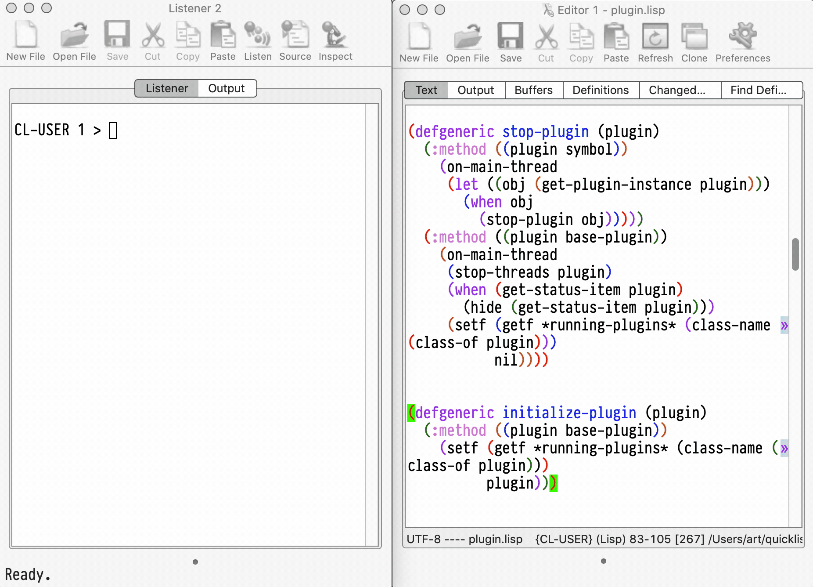

LispWorks Color Theme Extension
===============================



How To Use It
-------------

First, set up the quicklisp distribution with LispWorks extensions:

```
(ql-dist:install-dist "http://dist.ultralisp.org/lispworks.txt"
                      :prompt nil)
```

Next, load the extension and choose the theme.
You can place these lines into your `~/.lispworks` init file:

```lisp
(ql:quickload :lw-color-theme)

(lw-color-theme:color-theme "solarized-light")
```

Pay attention, this extension should be loaded in the init files. If you'll
try to quickload it from the REPL and then change the color theme, it will not work propertly.
